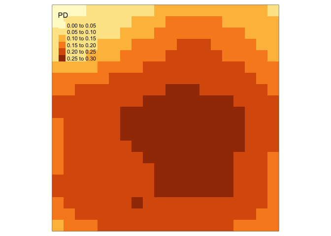
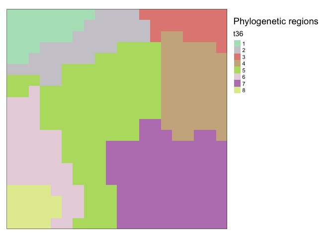
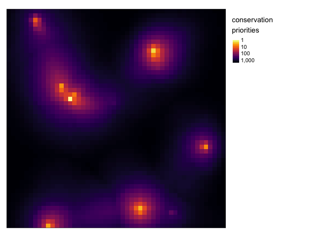

<!-- README.md is generated from README.Rmd. Please edit that file -->

# spatialphy

<!-- badges: start -->
<!-- badges: end -->

`spatialphy` is an R package for spatial phylogentic analysis. The field
of spatial phylogenetics is focused on accounting for evolutionary
relationships among taxa when describing biodiversity patterns, which
has a number of advantages over species-based accounting. This library
currently includes functions for computing:

-   diversity measures like phylogenetic diversity
-   turnover measures like phylogenetic betaendemism
-   phylogenetic regionalization
-   phylogenetic conservation prioritization

The package is still actively under development; there may be bugs, and
the API is subject to change.

## Installation

This package is not yet on CRAN. You can install the development version
of spatialphy like so:

``` r
devtools::install_github("matthewkling/spatialphy")
```

## Examples

Spatial phylogenetic analyses require two essential ingredients: data on
the geographic distributions of a set of organisms, and a phylogeny
representing their evolutionary relationships. All workflows in the
spatialphy package will involve creating a dataset of class
`'spatialphy'` containing these necessary components.

A user would normally define this object with their own data using the
`sphy()` function, but we can also simulate a demonstraiton dataset
using `sphy_simulate()`, which we’ll do here. The dataset is a list
containing:

-   a phylogeny
-   a matrix of occrrence data for evey clade at every level of the tree
    (this is constructed internally from user-supplied data about the
    occurrences of the terminal taxa)
-   some spatial metadata, in the form of a raster layer

``` r
library(spatialphy)
library(tmap); library(magrittr) # for visualization
set.seed(123)
sp <- sphy_simulate(n_tips = 50)
```

#### Alpha diversity

We can then pass this data object to the other functions in the library.
The `sphy_diversity()` function calculates a number of alpha diversity
measures, including phylogenetic diversity (PD), phylogenetic endemism
(PE), and several others.

``` r
div <- sphy_diversity(sp)
names(div)
#>  [1] "TR"  "CR"  "PD"  "TE"  "CE"  "PE"  "Em"  "PDm" "PEm" "BEm"
tm_shape(div$PD) + tm_raster()
```



#### Beta diversity (turnover)

We can also look at patterns in the phylogenetic similarity among
locations. The first step here is to compute the community phylogenetic
distance between every pair of sites; we’ll use the `phylo_dist()`
function to add a pariwise distance matrix as an additional component in
our spatialphy dataset.

``` r
sp <- sphy_dist(sp, add = T)
```

Having done this, we can then assess spatial turnover patterns in a
couple ways. We can qualitatively visualize them by converting the
distance matrix to a set of colors representing how similar two sites
are to each other, using the `phylo_rgb()` function:

``` r
sp %>%
      sphy_rgb() %>%
      tm_shape() +
      tm_rgb(max.value = 1) +
      tm_layout(title = "Phylogenetic ordination")
```


We can also perform a more formal cluster analysis that splits the
landscape into a set of evolutionary bioregions, using the
`phylo_regions()` function. We’ll ask for eight regions:

``` r
sp %>%
      sphy_regions(k = 8) %>%
      tm_shape() +
      tm_raster(palette = "cat") +
      tm_layout(legend.outside = T,
                title = "Phylogenetic regions")
```



#### Conservation prioritization

Finally, this package can also perform a basic spatial conservation
prioritization, identifying priority locations for the creation of new
protected areas in order to maximize biodiversity protection. This is
done using the `prioritize()` function, which uses a greedy forward
stepwise algorithm to produce a nested ranking of conservation
priorities.

In addition to our spatial phylogenetic dataset, we could optionally
supply a raster layer indicating the locations and effectiveness of
existing protected areas. We could also modify parameters that specify
the effective level of protection provided by new reserves, as well as
the shape of the “benefit” function that determines the relative
importance of protecting the initial populations of every taxon versus
more populations of more phylogenetcally distinct taxa. But here we’ll
stick with the defaults. In the map below, the highest-priority sites
are in yellow.

``` r
sp %>%
      sphy_prioritize() %>%
      tm_shape() + 
      tm_raster(palette = c("yellow", "red", "blue", "black"),
                colorNA = "gray80", n = 20,
                title = "conservation priorities") + 
      tm_layout(legend.outside = T)
```


