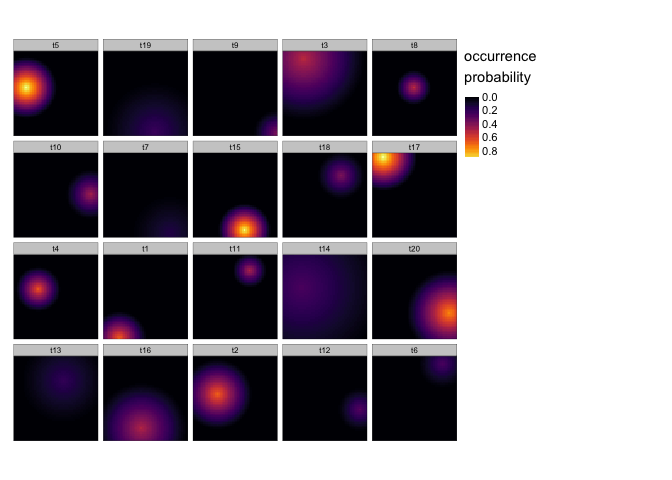

<!-- README.md is generated from README.Rmd. Please edit that file -->

# spatialphy

<!-- badges: start -->
<!-- badges: end -->

`spatialphy` is an R package for spatial phylogentic analysis. The field
of spatial phylogenetics focuses on accounting for evolutionary
relationships among taxa when describing biodiversity patterns, an
approach that has a number of advantages over species-based accounting.
This library currently includes functions for computing:

- diversity measures like phylogenetic diversity
- turnover measures like phylogenetic betaendemism
- phylogenetic regionalization
- phylogenetic conservation prioritization

One feature that differentiates `spatialphy` from some similar packages
is that in addition to working with binary presence/absence data, it’s
also designed to work with continuous quantities such as occurrence
probabilities or abunances. These quantities are treated as weights
throughout all the analyses in the package, avoiding the need to discard
information by thresholding the data.

## Installation

This package is not yet on CRAN. You can install the development version
of spatialphy like so:

``` r
# install.packages("remotes")
remotes::install_github("matthewkling/spatialphy")
```

## Examples

Spatial phylogenetic analyses require two essential ingredients: data on
the geographic distributions of a set of organisms, and a phylogeny
representing their evolutionary relationships. All workflows in the
spatialphy package involve creating a data set of class `'spatialphy'`
containing these necessary components. A user would normally define this
object with their own data using the `sphy()` function, but we can also
simulate a demonstration dataset using `sphy_simulate()`.

To get started, let’s load the `spatialphy` library and simulate a demo
data set. To get a peek at the underlying data, let’s plot the
geographic ranges of the terminal species:

``` r
library(spatialphy)
library(tmap); library(magrittr)
set.seed(123)
sp <- sphy_simulate(n_tips = 20, n_x = 50, n_y = 50)
tm_shape(get_tip_occs(sp, spatial = TRUE)) + 
      tm_raster(palette = "inferno", style = "cont", title = "occurrence\nprobability")
```



#### Alpha diversity

We can pass this our `spatialphy` object to various other functions in
the library. The `sphy_diversity()` function calculates a number of
alpha diversity measures, including phylogenetic diversity (PD) and
phylogenetic endemism (PE), among others. Let’s calculate the diversity
metrics and make a plot of PD:

``` r
div <- sphy_diversity(sp)
names(div)
#>  [1] "TR"  "CR"  "PD"  "TE"  "CE"  "PE"  "Em"  "RPD" "PEm" "RPE"
tm_shape(div$PD) + tm_raster(palette = "inferno", style = "cont")
```


We can also use randomization to calculate the significance of these
diversity metrics under a null model, using the `sphy_rand()` function.
The default null model uses a stratified randomization designed for use
with continuous occurrence data. Let’s run 100 randomizations and plot
the results for PE. This is a quantile value that gives the proportion
of randomizations in which observed PE was greater than randomized PE in
a given grid cell (if you wanted to identify “statistically significant”
grid cells in a one-tailed test with alpha = 0.05, these would be cells
with values greater than 0.95).

``` r
rand <- sphy_rand(sp, n_rand = 100)
#>   |                                                                              |                                                                      |   0%  |                                                                              |=                                                                     |   1%  |                                                                              |=                                                                     |   2%  |                                                                              |==                                                                    |   3%  |                                                                              |===                                                                   |   4%  |                                                                              |====                                                                  |   5%  |                                                                              |====                                                                  |   6%  |                                                                              |=====                                                                 |   7%  |                                                                              |======                                                                |   8%  |                                                                              |======                                                                |   9%  |                                                                              |=======                                                               |  10%  |                                                                              |========                                                              |  11%  |                                                                              |========                                                              |  12%  |                                                                              |=========                                                             |  13%  |                                                                              |==========                                                            |  14%  |                                                                              |==========                                                            |  15%  |                                                                              |===========                                                           |  16%  |                                                                              |============                                                          |  17%  |                                                                              |=============                                                         |  18%  |                                                                              |=============                                                         |  19%  |                                                                              |==============                                                        |  20%  |                                                                              |===============                                                       |  21%  |                                                                              |===============                                                       |  22%  |                                                                              |================                                                      |  23%  |                                                                              |=================                                                     |  24%  |                                                                              |==================                                                    |  25%  |                                                                              |==================                                                    |  26%  |                                                                              |===================                                                   |  27%  |                                                                              |====================                                                  |  28%  |                                                                              |====================                                                  |  29%  |                                                                              |=====================                                                 |  30%  |                                                                              |======================                                                |  31%  |                                                                              |======================                                                |  32%  |                                                                              |=======================                                               |  33%  |                                                                              |========================                                              |  34%  |                                                                              |========================                                              |  35%  |                                                                              |=========================                                             |  36%  |                                                                              |==========================                                            |  37%  |                                                                              |===========================                                           |  38%  |                                                                              |===========================                                           |  39%  |                                                                              |============================                                          |  40%  |                                                                              |=============================                                         |  41%  |                                                                              |=============================                                         |  42%  |                                                                              |==============================                                        |  43%  |                                                                              |===============================                                       |  44%  |                                                                              |================================                                      |  45%  |                                                                              |================================                                      |  46%  |                                                                              |=================================                                     |  47%  |                                                                              |==================================                                    |  48%  |                                                                              |==================================                                    |  49%  |                                                                              |===================================                                   |  50%  |                                                                              |====================================                                  |  51%  |                                                                              |====================================                                  |  52%  |                                                                              |=====================================                                 |  53%  |                                                                              |======================================                                |  54%  |                                                                              |======================================                                |  55%  |                                                                              |=======================================                               |  56%  |                                                                              |========================================                              |  57%  |                                                                              |=========================================                             |  58%  |                                                                              |=========================================                             |  59%  |                                                                              |==========================================                            |  60%  |                                                                              |===========================================                           |  61%  |                                                                              |===========================================                           |  62%  |                                                                              |============================================                          |  63%  |                                                                              |=============================================                         |  64%  |                                                                              |==============================================                        |  65%  |                                                                              |==============================================                        |  66%  |                                                                              |===============================================                       |  67%  |                                                                              |================================================                      |  68%  |                                                                              |================================================                      |  69%  |                                                                              |=================================================                     |  70%  |                                                                              |==================================================                    |  71%  |                                                                              |==================================================                    |  72%  |                                                                              |===================================================                   |  73%  |                                                                              |====================================================                  |  74%  |                                                                              |====================================================                  |  75%  |                                                                              |=====================================================                 |  76%  |                                                                              |======================================================                |  77%  |                                                                              |=======================================================               |  78%  |                                                                              |=======================================================               |  79%  |                                                                              |========================================================              |  80%  |                                                                              |=========================================================             |  81%  |                                                                              |=========================================================             |  82%  |                                                                              |==========================================================            |  83%  |                                                                              |===========================================================           |  84%  |                                                                              |============================================================          |  85%  |                                                                              |============================================================          |  86%  |                                                                              |=============================================================         |  87%  |                                                                              |==============================================================        |  88%  |                                                                              |==============================================================        |  89%  |                                                                              |===============================================================       |  90%  |                                                                              |================================================================      |  91%  |                                                                              |================================================================      |  92%  |                                                                              |=================================================================     |  93%  |                                                                              |==================================================================    |  94%  |                                                                              |==================================================================    |  95%  |                                                                              |===================================================================   |  96%  |                                                                              |====================================================================  |  97%  |                                                                              |===================================================================== |  98%  |                                                                              |===================================================================== |  99%  |                                                                              |======================================================================| 100%
tm_shape(rand$qPE) + tm_raster(palette = "inferno", style = "cont")
```


#### Beta diversity (turnover)

We can also look at patterns in the phylogenetic similarity among
locations. The first step here is to compute the community phylogenetic
distance between every pair of sites, using the `sphy_dist()` function
to add a pairwise distance matrix as an additional component in our
spatialphy dataset.

``` r
sp <- sphy_dist(sp, add = TRUE)
```

Having done this, we can then assess spatial turnover patterns in a
couple ways. We can qualitatively visualize compositional differences by
converting the distance matrix to a set of colors representing how
similar two sites are to each other, using the `sphy_rgb()` function:

``` r
sp %>%
      sphy_rgb(method = "cmds") %>%
      tm_shape() +
      tm_rgb(max.value = 1) +
      tm_layout(title = "Phylogenetic ordination")
```


We can also perform a more formal cluster analysis that splits the
landscape into a set of evolutionary bioregions, using the
`sphy_regions()` function. Let’s ask for eight regions using the
“kmeans” clustering method:

``` r
sp %>%
      sphy_regions(k = 8, method = "kmeans") %>%
      tm_shape() +
      tm_raster(style = "cat", palette = "Dark2",
                title = "phylogenetic region") +
      tm_layout(legend.outside = T)
```


#### Conservation prioritization

Finally, this package can perform a basic spatial conservation
prioritization, identifying priority locations for the creation of new
protected areas in order to maximize biodiversity protection. This is
done using the `sphy_prioritize()` function, which uses a greedy forward
stepwise algorithm to produce a nested ranking of conservation
priorities.

In addition to the required spatial phylogenetic dataset, there is the
option to supply a raster layer indicating the locations and
effectiveness of existing protected areas. We could also modify
parameters that specify the effective level of protection provided by
new reserves, as well as the shape of the “benefit” function that
determines the relative importance of protecting the initial populations
of every taxon versus more populations of more phylogenetically distinct
taxa. But for this example let’s stick with the defaults. In the map
below, the highest-priority sites are shown in yellow.

``` r
sp %>%
      sphy_prioritize() %>%
      tm_shape() + 
      tm_raster(palette = "-inferno", style = "log10",
                title = "conservation\npriorities") + 
      tm_layout(legend.outside = T)
#>   |                                                                              |                                                                      |   0%  |                                                                              |                                                                      |   1%  |                                                                              |=                                                                     |   1%  |                                                                              |=                                                                     |   2%  |                                                                              |==                                                                    |   2%  |                                                                              |==                                                                    |   3%  |                                                                              |==                                                                    |   4%  |                                                                              |===                                                                   |   4%  |                                                                              |===                                                                   |   5%  |                                                                              |====                                                                  |   5%  |                                                                              |====                                                                  |   6%  |                                                                              |=====                                                                 |   6%  |                                                                              |=====                                                                 |   7%  |                                                                              |=====                                                                 |   8%  |                                                                              |======                                                                |   8%  |                                                                              |======                                                                |   9%  |                                                                              |=======                                                               |   9%  |                                                                              |=======                                                               |  10%  |                                                                              |=======                                                               |  11%  |                                                                              |========                                                              |  11%  |                                                                              |========                                                              |  12%  |                                                                              |=========                                                             |  12%  |                                                                              |=========                                                             |  13%  |                                                                              |=========                                                             |  14%  |                                                                              |==========                                                            |  14%  |                                                                              |==========                                                            |  15%  |                                                                              |===========                                                           |  15%  |                                                                              |===========                                                           |  16%  |                                                                              |============                                                          |  16%  |                                                                              |============                                                          |  17%  |                                                                              |============                                                          |  18%  |                                                                              |=============                                                         |  18%  |                                                                              |=============                                                         |  19%  |                                                                              |==============                                                        |  19%  |                                                                              |==============                                                        |  20%  |                                                                              |==============                                                        |  21%  |                                                                              |===============                                                       |  21%  |                                                                              |===============                                                       |  22%  |                                                                              |================                                                      |  22%  |                                                                              |================                                                      |  23%  |                                                                              |================                                                      |  24%  |                                                                              |=================                                                     |  24%  |                                                                              |=================                                                     |  25%  |                                                                              |==================                                                    |  25%  |                                                                              |==================                                                    |  26%  |                                                                              |===================                                                   |  26%  |                                                                              |===================                                                   |  27%  |                                                                              |===================                                                   |  28%  |                                                                              |====================                                                  |  28%  |                                                                              |====================                                                  |  29%  |                                                                              |=====================                                                 |  29%  |                                                                              |=====================                                                 |  30%  |                                                                              |=====================                                                 |  31%  |                                                                              |======================                                                |  31%  |                                                                              |======================                                                |  32%  |                                                                              |=======================                                               |  32%  |                                                                              |=======================                                               |  33%  |                                                                              |=======================                                               |  34%  |                                                                              |========================                                              |  34%  |                                                                              |========================                                              |  35%  |                                                                              |=========================                                             |  35%  |                                                                              |=========================                                             |  36%  |                                                                              |==========================                                            |  36%  |                                                                              |==========================                                            |  37%  |                                                                              |==========================                                            |  38%  |                                                                              |===========================                                           |  38%  |                                                                              |===========================                                           |  39%  |                                                                              |============================                                          |  39%  |                                                                              |============================                                          |  40%  |                                                                              |============================                                          |  41%  |                                                                              |=============================                                         |  41%  |                                                                              |=============================                                         |  42%  |                                                                              |==============================                                        |  42%  |                                                                              |==============================                                        |  43%  |                                                                              |==============================                                        |  44%  |                                                                              |===============================                                       |  44%  |                                                                              |===============================                                       |  45%  |                                                                              |================================                                      |  45%  |                                                                              |================================                                      |  46%  |                                                                              |=================================                                     |  46%  |                                                                              |=================================                                     |  47%  |                                                                              |=================================                                     |  48%  |                                                                              |==================================                                    |  48%  |                                                                              |==================================                                    |  49%  |                                                                              |===================================                                   |  49%  |                                                                              |===================================                                   |  50%  |                                                                              |===================================                                   |  51%  |                                                                              |====================================                                  |  51%  |                                                                              |====================================                                  |  52%  |                                                                              |=====================================                                 |  52%  |                                                                              |=====================================                                 |  53%  |                                                                              |=====================================                                 |  54%  |                                                                              |======================================                                |  54%  |                                                                              |======================================                                |  55%  |                                                                              |=======================================                               |  55%  |                                                                              |=======================================                               |  56%  |                                                                              |========================================                              |  56%  |                                                                              |========================================                              |  57%  |                                                                              |========================================                              |  58%  |                                                                              |=========================================                             |  58%  |                                                                              |=========================================                             |  59%  |                                                                              |==========================================                            |  59%  |                                                                              |==========================================                            |  60%  |                                                                              |==========================================                            |  61%  |                                                                              |===========================================                           |  61%  |                                                                              |===========================================                           |  62%  |                                                                              |============================================                          |  62%  |                                                                              |============================================                          |  63%  |                                                                              |============================================                          |  64%  |                                                                              |=============================================                         |  64%  |                                                                              |=============================================                         |  65%  |                                                                              |==============================================                        |  65%  |                                                                              |==============================================                        |  66%  |                                                                              |===============================================                       |  66%  |                                                                              |===============================================                       |  67%  |                                                                              |===============================================                       |  68%  |                                                                              |================================================                      |  68%  |                                                                              |================================================                      |  69%  |                                                                              |=================================================                     |  69%  |                                                                              |=================================================                     |  70%  |                                                                              |=================================================                     |  71%  |                                                                              |==================================================                    |  71%  |                                                                              |==================================================                    |  72%  |                                                                              |===================================================                   |  72%  |                                                                              |===================================================                   |  73%  |                                                                              |===================================================                   |  74%  |                                                                              |====================================================                  |  74%  |                                                                              |====================================================                  |  75%  |                                                                              |=====================================================                 |  75%  |                                                                              |=====================================================                 |  76%  |                                                                              |======================================================                |  76%  |                                                                              |======================================================                |  77%  |                                                                              |======================================================                |  78%  |                                                                              |=======================================================               |  78%  |                                                                              |=======================================================               |  79%  |                                                                              |========================================================              |  79%  |                                                                              |========================================================              |  80%  |                                                                              |========================================================              |  81%  |                                                                              |=========================================================             |  81%  |                                                                              |=========================================================             |  82%  |                                                                              |==========================================================            |  82%  |                                                                              |==========================================================            |  83%  |                                                                              |==========================================================            |  84%  |                                                                              |===========================================================           |  84%  |                                                                              |===========================================================           |  85%  |                                                                              |============================================================          |  85%  |                                                                              |============================================================          |  86%  |                                                                              |=============================================================         |  86%  |                                                                              |=============================================================         |  87%  |                                                                              |=============================================================         |  88%  |                                                                              |==============================================================        |  88%  |                                                                              |==============================================================        |  89%  |                                                                              |===============================================================       |  89%  |                                                                              |===============================================================       |  90%  |                                                                              |===============================================================       |  91%  |                                                                              |================================================================      |  91%  |                                                                              |================================================================      |  92%  |                                                                              |=================================================================     |  92%  |                                                                              |=================================================================     |  93%  |                                                                              |=================================================================     |  94%  |                                                                              |==================================================================    |  94%  |                                                                              |==================================================================    |  95%  |                                                                              |===================================================================   |  95%  |                                                                              |===================================================================   |  96%  |                                                                              |====================================================================  |  96%  |                                                                              |====================================================================  |  97%  |                                                                              |====================================================================  |  98%  |                                                                              |===================================================================== |  98%  |                                                                              |===================================================================== |  99%  |                                                                              |======================================================================|  99%  |                                                                              |======================================================================| 100%
```


